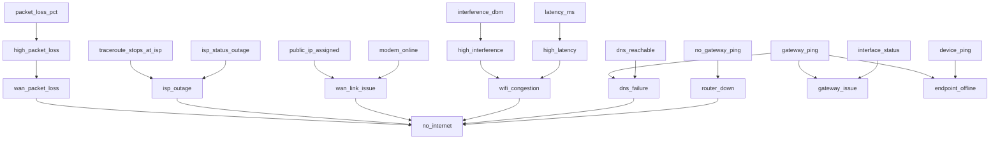

# NetSage (Expert-System CLI + Web)

LAN/Wi-Fi/WAN diagnostic expert system with recursive backward chaining, certainty factors, fuzzy inputs, and explainability.

## Highlights

- **Goal-driven recursive inference** (`no_internet` can depend on sub-goals like `router_down` and `dns_failure`).
- **Info-gain question selection** to ask the most informative missing fact first.
- **Weighted confidence accumulation** via Shortliffe/MYCIN combination plus optional per-rule weights.
- **Fuzzy numeric facts** mapped to derived CF facts (`latency_ms -> high_latency`, `interference_dbm -> high_interference`).
- **Why explanation command** during questioning (`why`) to explain why a fact is requested.
- **Auto-probe first** (gateway ping, DNS ping, interface state) before asking the user.
- **Web form mode** to avoid CLI `input()` prompts.
- **LAN → WAN expansion** including ISP outage, WAN lease, and upstream packet-loss diagnostics.

## Files

- `knowledge/lan_rules.json`: goals + rules with CF and explanations.
- `knowledge/question_graph.json`: fact questions, plain-language explainers, fuzzy derivations, auto-probe hints.
- `netsage_cli.py`: inference engine + CLI + web server.

## Backward-chaining dependency graph



## Usage

```bash
# optional (kept for standard workflow compatibility)
python -m pip install -r requirements.txt

# deterministic scenario
python netsage_cli.py --demo

# run with known facts
python netsage_cli.py --facts '{"gateway_ping":true,"dns_reachable":false,"latency_ms":120,"interference_dbm":-68}'

# run with no preset facts (auto-probe + inference, no interactive questions)
python netsage_cli.py --facts

# interactive run for a single goal (supports typing "why")
python netsage_cli.py --goal no_internet

# web form mode (no input() prompts)
python netsage_cli.py --web --host 127.0.0.1 --port 8000
```

## Web Interface Commands

Run web UI locally:

```bash
python netsage_cli.py --web --host 127.0.0.1 --port 8000
```

Open in browser:

- Linux/macOS: `http://127.0.0.1:8000`
- Windows: `http://127.0.0.1:8000`

Optional host/port examples:

```bash
# expose on all interfaces (for LAN testing)
python netsage_cli.py --web --host 0.0.0.0 --port 8080

# custom goal can be entered directly in the web form
python netsage_cli.py --web --port 9000
```

On Windows PowerShell, `python3` may not exist unless you install an alias. Use `python` by default.

## Rulebook (R1-R16)

Each rule has this shape:

- `IF` all conditions are true,
- then the rule contributes evidence to its `THEN` goal,
- contribution = `min(condition CFs) * rule CF`.

The final confidence for a goal combines multiple fired rules with the MYCIN positive-evidence formula.

- **R1**: `IF no_gateway_ping == true THEN router_down (CF=0.95)`
  - Meaning: if the gateway cannot be reached, router outage is very likely.
  - Impact: strong direct evidence for `router_down`.

- **R2**: `IF router_down >= 0.7 THEN no_internet (CF=0.9)`
  - Meaning: once router-down confidence is high, internet outage is very likely.
  - Impact: escalates router failure into top-level outage.

- **R3**: `IF dns_reachable == false AND gateway_ping == true THEN dns_failure (CF=0.85)`
  - Meaning: local gateway is reachable but DNS is not, so issue points to DNS path/service.
  - Impact: strong evidence for `dns_failure` while local LAN appears up.

- **R4**: `IF high_interference >= 0.6 AND high_latency >= 0.6 THEN wifi_congestion (CF=0.8)`
  - Meaning: RF noise plus elevated latency indicates congestion on Wi-Fi.
  - Impact: infers `wifi_congestion` from fuzzy-derived sub-facts.

- **R5**: `IF gateway_ping == false AND interface_status == up THEN gateway_issue (CF=0.8)`
  - Meaning: local interface is operational but gateway unreachable, suggesting routing/gateway problem.
  - Impact: separates gateway/routing faults from link-down faults.

- **R6**: `IF device_ping == false AND gateway_ping == true THEN endpoint_offline (CF=0.75)`
  - Meaning: gateway responds but target LAN device does not, so endpoint itself is likely down.
  - Impact: localizes fault to endpoint availability.

- **R7**: `IF dns_failure >= 0.6 THEN no_internet (CF=0.8)`
  - Meaning: substantial DNS failure can present as internet outage.
  - Impact: contributes outage evidence from DNS diagnosis.

- **R8**: `IF wifi_congestion >= 0.6 THEN no_internet (CF=0.65)`
  - Meaning: severe Wi-Fi congestion can look like internet loss.
  - Impact: adds outage evidence sourced from wireless conditions.

- **R9**: `IF modem_online == false THEN wan_link_issue (CF=0.9)`
  - Meaning: modem/ONT offline usually indicates WAN handoff failure.
  - Impact: strong WAN-link fault evidence.

- **R10**: `IF modem_online == true AND public_ip_assigned == false THEN wan_link_issue (CF=0.85)`
  - Meaning: active modem without public lease points to ISP provisioning/lease issue.
  - Impact: reinforces WAN-link diagnosis.

- **R11**: `IF isp_status_outage == true THEN isp_outage (CF=0.9)`
  - Meaning: ISP confirms outage in area.
  - Impact: high-confidence provider-side fault.

- **R12**: `IF high_packet_loss >= 0.6 AND gateway_ping == true THEN wan_packet_loss (CF=0.8)`
  - Meaning: local gateway is fine but internet path drops packets heavily.
  - Impact: indicates unstable upstream WAN conditions.

- **R13**: `IF traceroute_stops_at_isp == true AND gateway_ping == true THEN isp_outage (CF=0.85)`
  - Meaning: traceroute dying in ISP path suggests provider/core issue.
  - Impact: adds evidence for ISP outage.

- **R14**: `IF wan_link_issue >= 0.6 THEN no_internet (CF=0.88)`
  - Meaning: strong WAN link issues typically mean no internet.
  - Impact: top-level outage evidence from WAN-link branch.

- **R15**: `IF isp_outage >= 0.6 THEN no_internet (CF=0.9)`
  - Meaning: provider outage directly causes internet loss.
  - Impact: strongest provider-side contribution to `no_internet`.

- **R16**: `IF wan_packet_loss >= 0.6 THEN no_internet (CF=0.75)`
  - Meaning: severe upstream loss can make service effectively unusable.
  - Impact: contributes degradation-based outage evidence.

## Question Explainers (Plain Language)

Each fact now has `user_explanation` text shown in CLI/web so normal users understand why it matters.

- `no_gateway_ping`: checks if your device can reach your local router.
- `gateway_ping`: separates local LAN issues from upstream/WAN issues.
- `dns_reachable`: verifies whether name-resolution infrastructure is reachable.
- `interface_status`: checks if local adapter/link is active.
- `device_ping`: isolates endpoint-specific failures.
- `latency_ms`: measures delay that signals congestion.
- `interference_dbm`: estimates RF contention/noise in Wi-Fi environment.
- `modem_online`: validates physical/logical WAN handoff status.
- `public_ip_assigned`: verifies successful ISP DHCP/PPPoE lease assignment.
- `isp_status_outage`: confirms known provider-side outages.
- `packet_loss_pct`: captures upstream quality degradation.
- `traceroute_stops_at_isp`: helps localize breakage to ISP path.

## Fuzzy Fact Mapping

- `latency_ms` derives `high_latency`:
  - `<= 30 -> 0.0`, `<= 100 -> 0.3`, `<= 500 -> 0.6`, `> 500 -> 1.0`
- `interference_dbm` derives `high_interference`:
  - `<= -90 -> 0.1`, `<= -75 -> 0.4`, `<= -65 -> 0.7`, `> -65 -> 1.0`
- `packet_loss_pct` derives `high_packet_loss`:
  - `<= 1 -> 0.1`, `<= 3 -> 0.3`, `<= 8 -> 0.6`, `> 8 -> 1.0`
