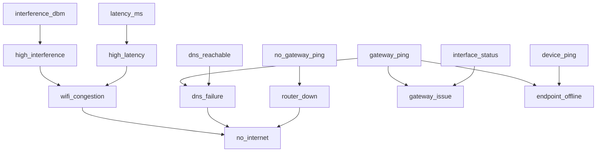

# NetSage (Expert-System CLI)

LAN/Wi-Fi diagnostic expert system starter with recursive backward chaining, certainty factors, fuzzy inputs, and explainability.

## Highlights

- **Goal-driven recursive inference** (`no_internet` can depend on sub-goals like `router_down` and `dns_failure`).
- **Certainty Factor algebra** via Shortliffe/MYCIN combination.
- **Fuzzy numeric facts** mapped to derived CF facts (`latency_ms -> high_latency`, `interference_dbm -> high_interference`).
- **Why explanation command** during questioning (`why`) to explain why a fact is requested.
- **Auto-probe first** (gateway ping, DNS ping, interface state) before asking the user.

## Files

- `knowledge/lan_rules.json`: goals + rules with CF and explanations.
- `knowledge/question_graph.json`: fact questions, types, fuzzy derivations, auto-probe hints.
- `netsage_cli.py`: inference engine + CLI.

## Backward-chaining dependency graph



## Usage

```bash
# deterministic scenario
python3 netsage_cli.py --demo

# run with known facts
python3 netsage_cli.py --facts '{"gateway_ping":true,"dns_reachable":false,"latency_ms":120,"interference_dbm":-68}'

# interactive run for a single goal (supports typing "why")
python3 netsage_cli.py --goal no_internet
```
